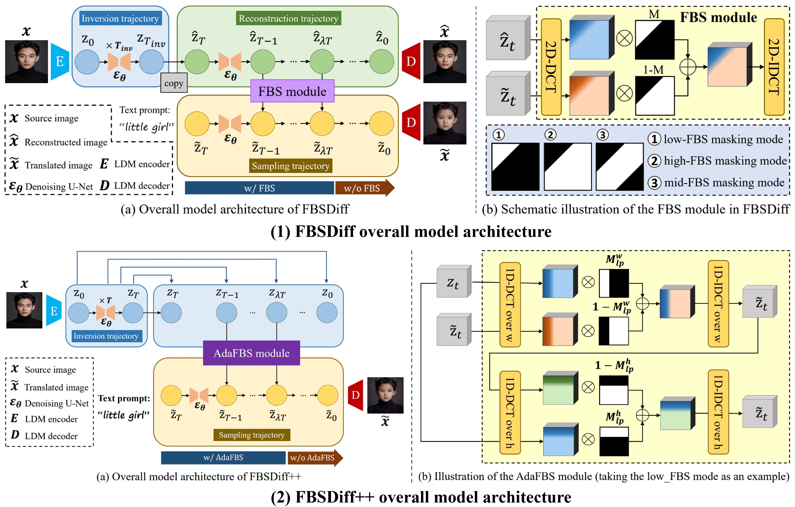

# FBSDiff++: Improved Frequency Band Substitution of Diffusion Features for Efficient and Highly Controllable Text-Driven Image-to-Image Translation
[IJCV 2026] Official code of the paper "FBSDiff++: Improved Frequency Band Substitution of Diffusion Features for Efficient and Highly Controllable Text-Driven Image-to-Image Translation". [Paper link](https://arxiv.org/pdf/2601.19115)

# Introduction
With large-scale text-to-image (T2I) diffusion models achieving significant advancements in open-domain image creation, increasing attention has been focused on their natural extension to the realm of text-driven image-to-image (I2I) translation, where a source image acts as visual guidance to the generated image in addition to the textual guidance provided by the text prompt. We propose FBSDiff, a novel framework adapting off-the-shelf T2I diffusion model into the I2I paradigm from a fresh frequency-domain perspective. Through dynamic frequency band substitution of diffusion features, FBSDiff realizes versatile and highly controllable text-driven I2I in a plug-and-play manner (without need for model training, fine-tuning, or online optimization), allowing appearance-guided, layout-guided, and contour-guided I2I translation by progressively substituting low-frequency band, mid-frequency band, and high-frequency band of latent diffusion features, respectively. In addition, FBSDiff flexibly enables continuous control over I2I correlation intensity simply by tuning the bandwidth of the substituted frequency band. To further promote image translation efficiency, flexibility, and functionality, we propose FBSDiff++ which improves upon FBSDiff mainly in three aspects: (1) accelerate inference speed by a large margin (8.9$\times$ speedup in inference) with refined model architecture; (2) improve the Frequency Band Substitution module to allow for input source images of arbitrary resolution and aspect ratio; (3) extend model functionality to enable localized image manipulation and style-specific content creation with only subtle adjustments to the core method. Extensive qualitative and quantitative experiments verify superiority of FBSDiff++ in I2I translation visual quality, efficiency, versatility, and controllability compared to related advanced approaches. 

# Model overview

Our previous work proposes FBSDiff, a plug-and-play method adapting pretrained T2I diffusion model to the realm of text-driven I2I translation from the perspective of dynamic frequency band substitution. FBSDiff comprises an inversion trajectory, a reconstruction trajectory, and a sampling trajectory, where 
